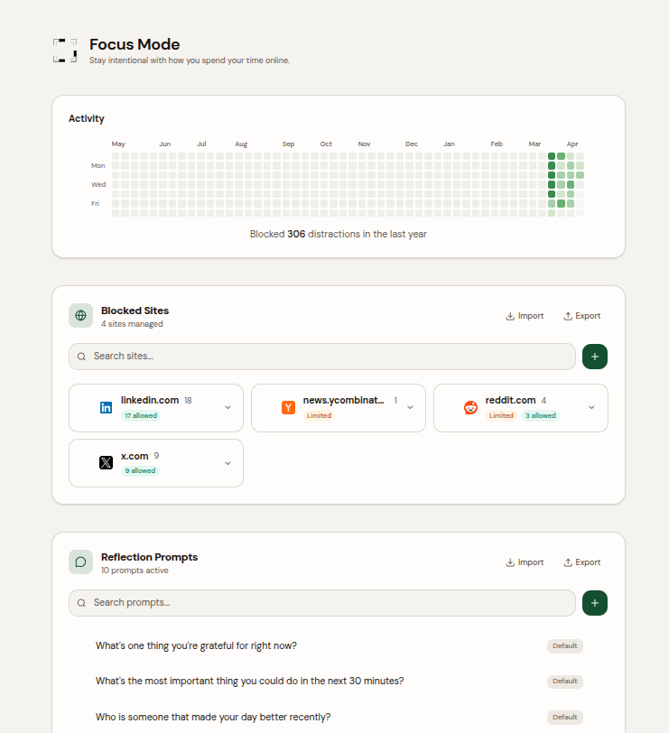

<p align="center">
  
</p>

<h1 align="center">Focus Mode</h1>

<p align="center">
  A minimalist browser extension that blocks distracting websites and helps you stay focused.
</p>

---

<p align="center">
  
</p>

## Installation

```sh
git clone git@github.com:the-wc/focus-mode.git
cd focus-mode
pnpm install
pnpm build
```

Load the extension in Chrome:

1. Open `chrome://extensions`
2. Enable **Developer mode**
3. Click **Load unpacked**
4. Select the `.output/chrome-mv3` folder

## Capabilities

- **Wildcard patterns** -- block `reddit.com`, `*.twitter.com`, or `reddit.com/r/funny/*`
- **Exceptions** -- allow specific pages even when the domain is blocked
- **Configurable sessions** -- set challenge duration, browse time, and session limits per rule
- **Reflection prompts** -- customizable prompts shown during the challenge timer
- **Presets** -- one-click import for Social Media and Video site blocks
- **Import / Export** -- share configs as JSON files
- **Activity heatmap** -- GitHub-style visualization of blocked distractions over the past year
- **Dark mode** -- follows your system preference

## Development

```sh
pnpm dev            # Start dev server with hot reload
pnpm build          # Production build for Chrome
pnpm build:firefox  # Production build for Firefox
pnpm zip            # Package for distribution
```

### Project Structure

```
focus-mode/
  entrypoints/
    background.ts          # Storage initialization
    content/               # Overlay (Shadow DOM + React)
      index.tsx             # Content script entry
      App.tsx               # Dark mode wrapper
      BlockedOverlay.tsx
      TimerPrompt.tsx       # Challenge timer + prompt
    popup/                  # Browser action popup
    dashboard/              # Full-page settings UI
  lib/
    storage.ts              # Typed storage definitions
    matching.ts             # Wildcard pattern matching
    prompts.ts              # Prompt pool + random selection
    presets.ts              # Built-in presets
  block-configs/            # Preset JSON files
    social-media.json
    videos.json
    default-prompts.json
  components/ui/            # shadcn components
  wxt.config.ts
```

### Sharing Your Configs

Export and import configs as JSON:

```json
{
  "name": "My Config",
  "rules": [
    {
      "pattern": "reddit.com",
      "timerSeconds": 30,
      "accessLimit": 2,
      "limitPeriod": "day",
      "browseSeconds": 300
    }
  ]
}
```
